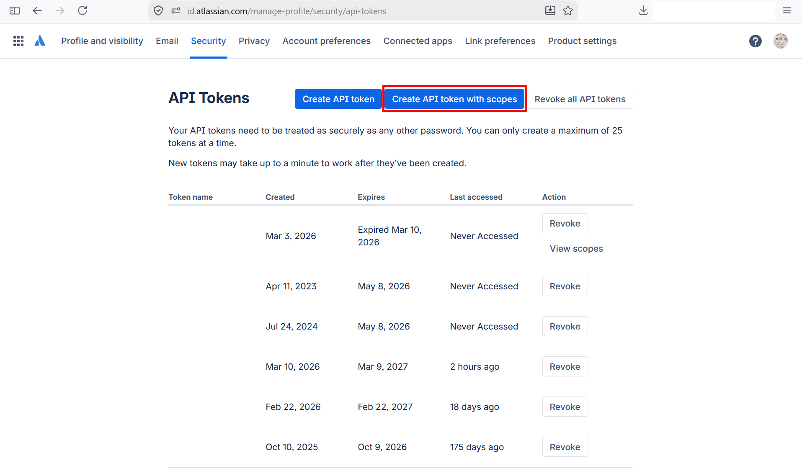
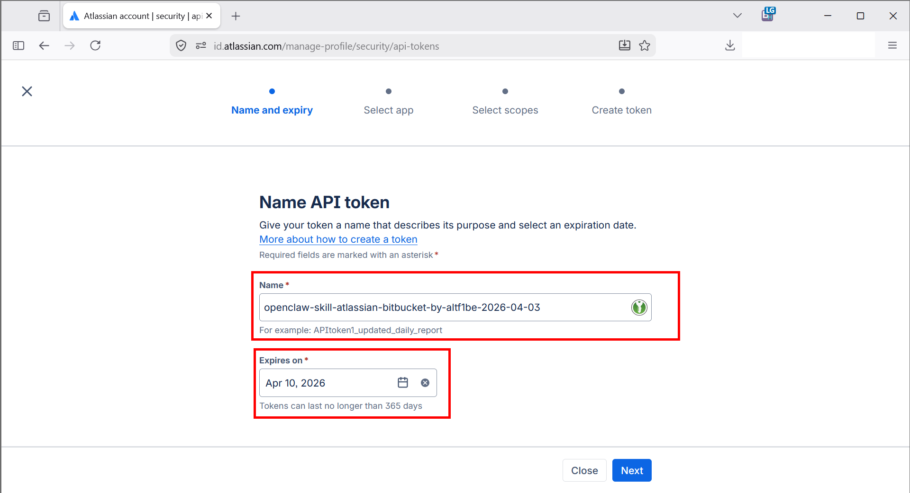
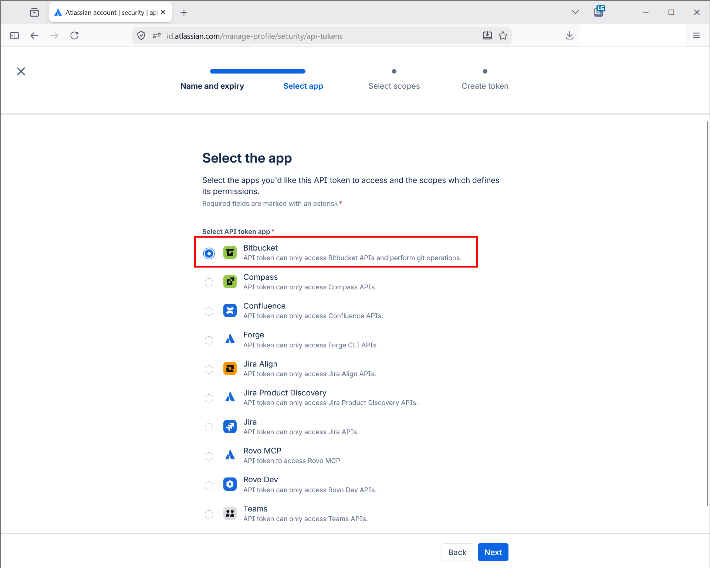
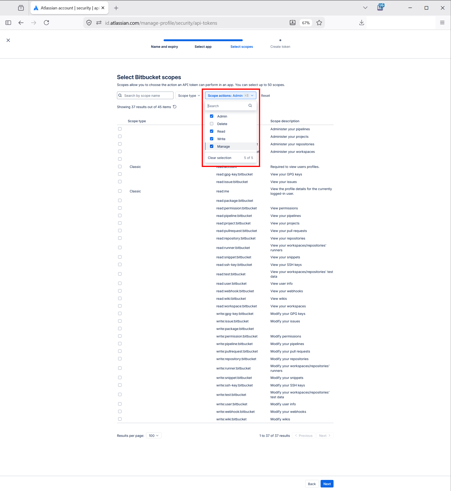
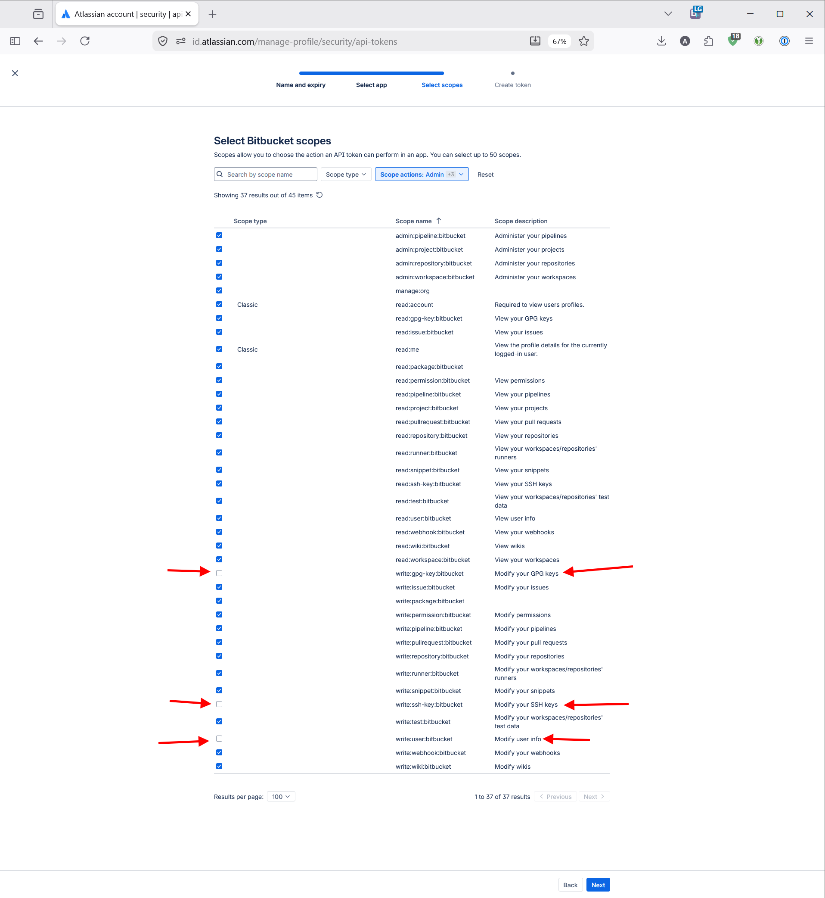
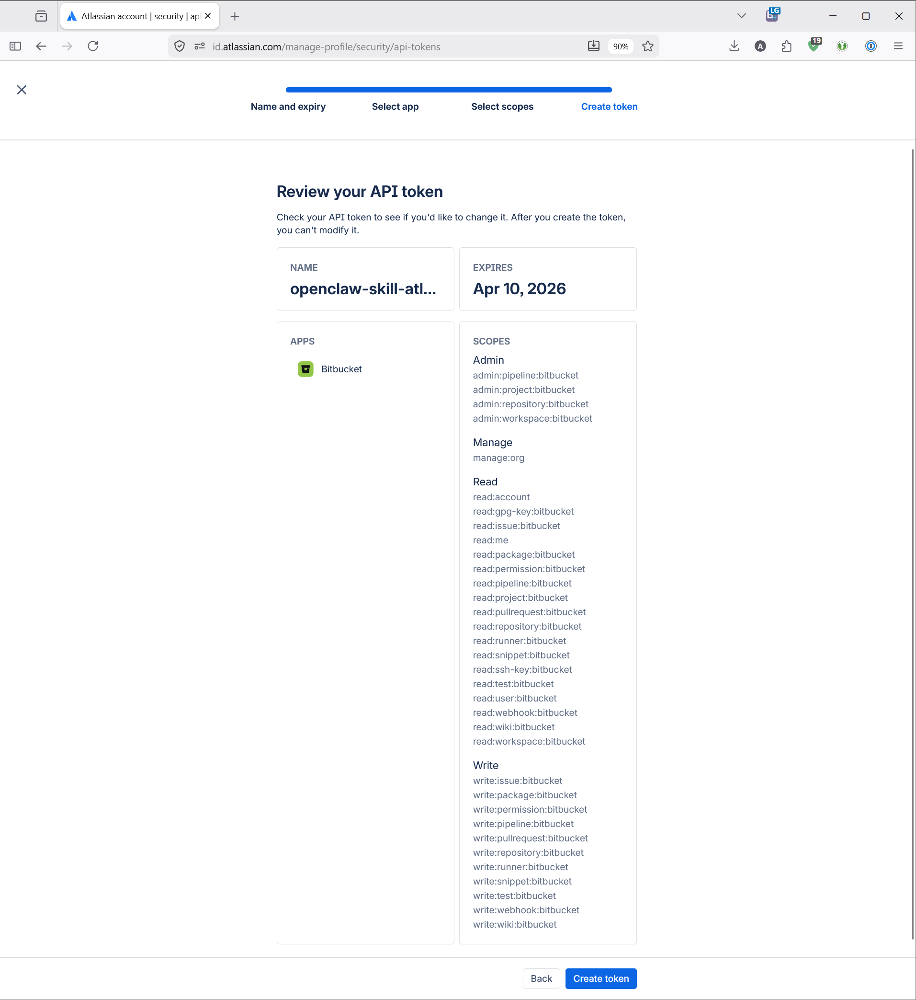
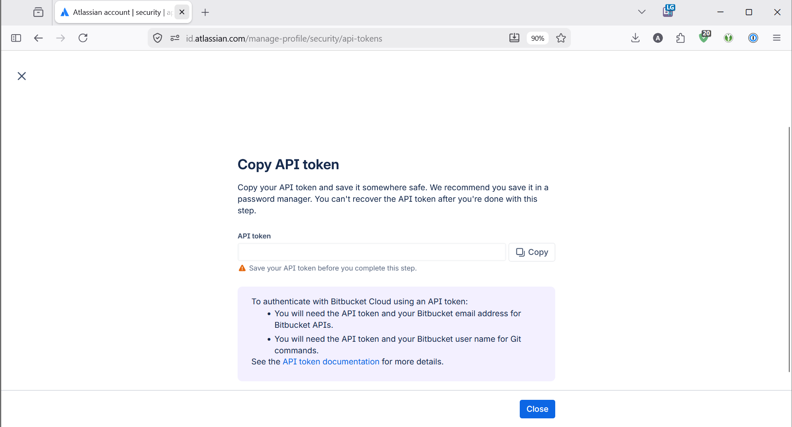

# :bucket: openclaw-skill-atlassian-bitbucket-by-altf1be

[](https://opensource.org/licenses/MIT)
[](https://nodejs.org/)
[](https://developer.atlassian.com/cloud/bitbucket/rest/intro/)
[](https://clawhub.ai)
[](https://clawhub.ai/skills/atlassian-bitbucket-by-altf1be)
[](https://github.com/ALT-F1-OpenClaw/openclaw-skill-atlassian-bitbucket-by-altf1be/commits/main)
[](https://github.com/ALT-F1-OpenClaw/openclaw-skill-atlassian-bitbucket-by-altf1be/issues)
[](https://github.com/ALT-F1-OpenClaw/openclaw-skill-atlassian-bitbucket-by-altf1be/stargazers)

OpenClaw skill for Atlassian Bitbucket Cloud — full CRUD via REST API 2.0

By [Abdelkrim BOUJRAF](https://www.alt-f1.be) / ALT-F1 SRL, Brussels

## Table of Contents

- [Features](#features)
- [Quick Start](#quick-start)
- [API Groups](#api-groups)
- [Authentication](#authentication)
- [Common Options](#common-options)
- [Environment Variables](#environment-variables)
- [Security](#security)
- [License](#license)
- [Author](#author)
- [Links](#links)

## Features

- **335 API endpoints** covering the entire Bitbucket Cloud REST API 2.0
- **23 API groups** — repositories, pull requests, pipelines, issues, and more
- **App Password authentication** — simple, secure, no OAuth flow required
- **Rate-limit retry** with exponential backoff (up to 3 attempts)
- **Pagination support** for all list operations
- **JSON output** for easy integration with other tools and scripts
- **Delete safety** — all destructive operations require explicit `--confirm`
- **Path traversal prevention** for file uploads
- **File size validation** before upload (50 MB default limit)

## Quick Start

```bash
# 1. Clone the repository
git clone https://github.com/ALT-F1-OpenClaw/openclaw-skill-atlassian-bitbucket-by-altf1be.git
cd openclaw-skill-atlassian-bitbucket-by-altf1be

# 2. Install dependencies
npm install

# 3. Configure environment
cp .env.example .env
# Edit .env with your Bitbucket credentials:
#   BITBUCKET_EMAIL=you@example.com
#   BITBUCKET_API_TOKEN=your-api-token
#   BITBUCKET_WORKSPACE=your-workspace

# 4. Run commands
node scripts/bitbucket.mjs repo-list --workspace my-workspace
node scripts/bitbucket.mjs repo-read --workspace my-workspace --repo my-repo
node scripts/bitbucket.mjs pr-list --workspace my-workspace --repo my-repo
node scripts/bitbucket.mjs pipeline-list --workspace my-workspace --repo my-repo
```

## API Groups

All 335 endpoints organized across 23 API groups:

| # | API Group | Endpoints |
|---|-----------|-----------|
| 1 | Addon | 10 |
| 2 | Branch restrictions | 5 |
| 3 | Branching model | 7 |
| 4 | Commit statuses | 4 |
| 5 | Commits | 16 |
| 6 | Deployments | 16 |
| 7 | Downloads | 4 |
| 8 | GPG | 4 |
| 9 | Issue tracker | 33 |
| 10 | Pipelines | 68 |
| 11 | Projects | 16 |
| 12 | Properties | 12 |
| 13 | Pullrequests | 36 |
| 14 | Refs | 9 |
| 15 | Reports | 9 |
| 16 | Repositories | 26 |
| 17 | Search | 3 |
| 18 | Snippets | 25 |
| 19 | Source | 4 |
| 20 | SSH | 5 |
| 21 | Users | 4 |
| 22 | Webhooks | 2 |
| 23 | Workspaces | 17 |

See [docs/API-COVERAGE.md](./docs/API-COVERAGE.md) for a full breakdown of every endpoint.

## Authentication

This skill uses **Atlassian API Tokens** for authentication (App Passwords were deprecated in September 2025 and will be disabled on June 9, 2026).

### Creating an API Token

#### Step 1 — Open the API Tokens page

Log in to your Atlassian account and go to **[Security → API tokens](https://id.atlassian.com/manage-profile/security/api-tokens)**.

Click **"Create API token with scopes"** (the blue outlined button) to create a scoped token for Bitbucket.



#### Step 2 — Name and expiry

Give the token a descriptive name (e.g., `openclaw-skill-atlassian-bitbucket-by-altf1be-2026-04-03`) and set an expiration date (max 365 days). Click **Next**.



#### Step 3 — Select the app

Select **Bitbucket** as the API token app. This ensures the token can only access Bitbucket APIs and perform git operations. Click **Next**.



#### Step 4 — Select scopes

Use the **"Scope actions"** filter to select the scope categories you need. For full CRUD access, select: **Admin**, **Read**, **Write**, and **Manage**.



Review the individual scopes. The red arrows below highlight scopes intentionally **left unchecked** for security:
- `write:gpg-key:bitbucket` — Modify GPG keys
- `write:ssh-key:bitbucket` — Modify SSH keys
- `write:user:bitbucket` — Modify user info



#### Step 5 — Review and create

Review the token summary: name, expiry, app, and all selected scopes. Once satisfied, click **"Create token"**.



#### Step 6 — Copy the token

**Copy the token immediately** — you won't be able to see it again after closing this dialog. Store it securely (e.g., in a password manager or your `.env` file).



The skill authenticates using HTTP Basic Auth with your Atlassian email and the API token.

> **Legacy support:** Existing App Passwords (`BITBUCKET_USERNAME` + `BITBUCKET_APP_PASSWORD`) are still accepted as a fallback until June 9, 2026. Migrate to API tokens before then.

## Common Options

| Option | Description |
|--------|-------------|
| `--workspace <slug>` | Bitbucket workspace slug |
| `--repo <slug>` | Repository slug |
| `--id <id>` | Resource identifier |
| `--page <n>` | Page number for paginated results |
| `--pagelen <n>` | Number of results per page (default: 50) |
| `--confirm` | Required flag for delete operations |
| `--help` | Show help for any command |

## Environment Variables

| Variable | Required | Description |
|----------|----------|-------------|
| `BITBUCKET_EMAIL` | Yes | Your Atlassian account email |
| `BITBUCKET_API_TOKEN` | Yes | API token from [id.atlassian.com](https://id.atlassian.com/manage-profile/security/api-tokens) |
| `BITBUCKET_WORKSPACE` | No | Default workspace slug (avoids passing `--workspace` every time) |
| `BITBUCKET_MAX_RESULTS` | No | Maximum results per page (default: `50`) |
| `BITBUCKET_USERNAME` | Legacy | Bitbucket username (fallback, deprecated June 2026) |
| `BITBUCKET_APP_PASSWORD` | Legacy | App password (fallback, deprecated June 2026) |

Create a `.env` file in the project root or export variables in your shell:

```bash
BITBUCKET_EMAIL=you@example.com
BITBUCKET_API_TOKEN=your-api-token
BITBUCKET_WORKSPACE=your-workspace
```

## Security

- API Token authentication (Basic auth, no OAuth flow needed)
- No secrets or tokens printed to stdout
- All delete operations require explicit `--confirm` flag
- Path traversal prevention for file uploads (`safePath()`)
- Built-in rate limiting with exponential backoff retry (3 attempts)
- File size validation before upload (50 MB limit)
- Lazy config validation (credentials only checked when a command runs)

## License

MIT — see [LICENSE](./LICENSE)

## Author

Abdelkrim BOUJRAF — [ALT-F1 SRL](https://www.alt-f1.be), Brussels

- GitHub: [@abdelkrim](https://github.com/abdelkrim)
- X: [@altf1be](https://x.com/altf1be)

## Links

- **Homepage:** [https://www.alt-f1.be](https://www.alt-f1.be)
- **Repository:** [https://github.com/ALT-F1-OpenClaw/openclaw-skill-atlassian-bitbucket-by-altf1be](https://github.com/ALT-F1-OpenClaw/openclaw-skill-atlassian-bitbucket-by-altf1be)
- **Bitbucket REST API docs:** [https://developer.atlassian.com/cloud/bitbucket/rest/intro/](https://developer.atlassian.com/cloud/bitbucket/rest/intro/)
- **Issues:** [https://github.com/ALT-F1-OpenClaw/openclaw-skill-atlassian-bitbucket-by-altf1be/issues](https://github.com/ALT-F1-OpenClaw/openclaw-skill-atlassian-bitbucket-by-altf1be/issues)
